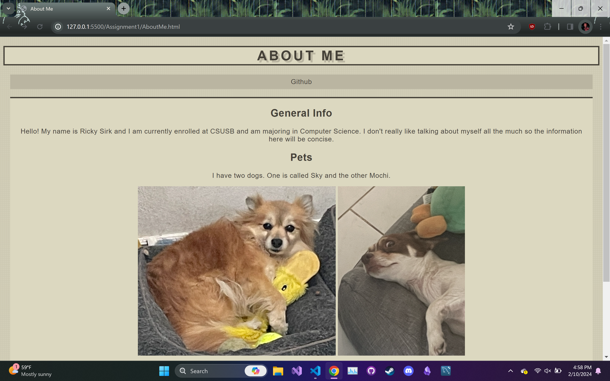
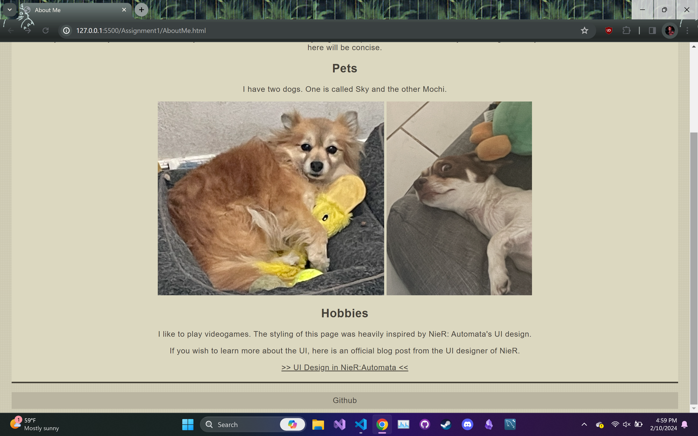

# About Me

A simple About Me page that utilizes html and css

Time spent: **4** hours spent in total

## Features

The following **required** features are completed:

- [x] Modifies title in head so that the tab has a unique name, (e.g. About Me). (1pts)
- [x] Uses a mix of headers, paragraphs, and div's. (3pts)
- [x] Includes at least 3 paragraphs. (3pts)
- [x] Includes at least one image. (2pts)
- [x] Includes a .css file to style with at least 4 ways to format the elements in the html. (3pts)
- [x] Includes a link that directs to your Github account (can be main account or specifically to your Platform_Computing Repo). (3pts)

The following **bonus** features are implemented:

- [x] Applies different font(s). (0.5 pt)
- [x] Applies border and margins. (0.5 pt)
- [ ] DESCRIBE ANY OTHER FEATURES HERE.

## Screenshot and/or Video Walkthrough

## Notes:
PROVIDE RELEVANT OR ADDITIONAL INFORMATION HERE. Below are formatting options to add emphasis in text
<ul>
  <li>Most of the time was spent on finding the color scheme for the website.</li>
  <li>The Github link is a button with one at the top and another at the bottom</li>
</ul>
