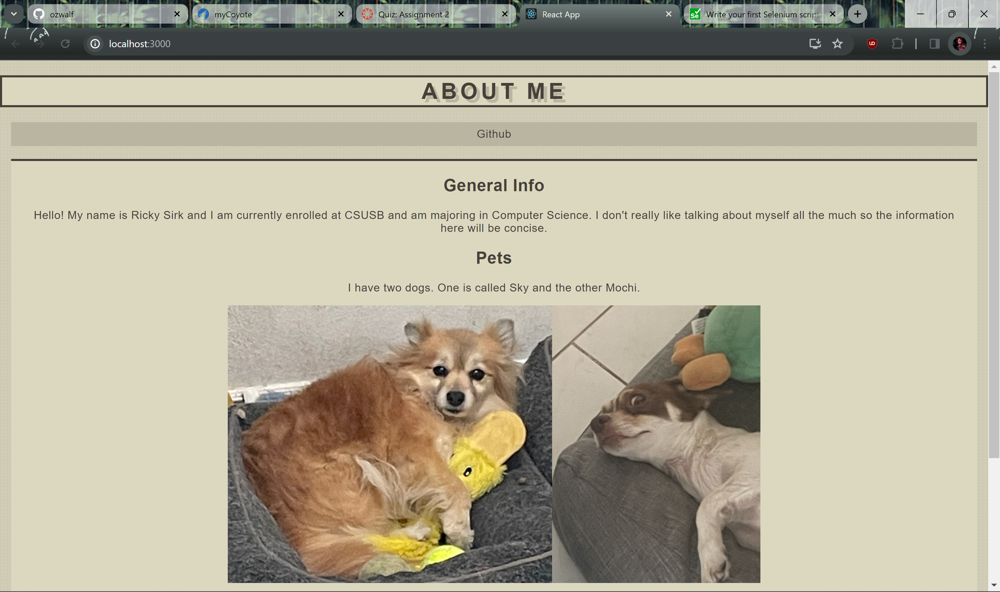
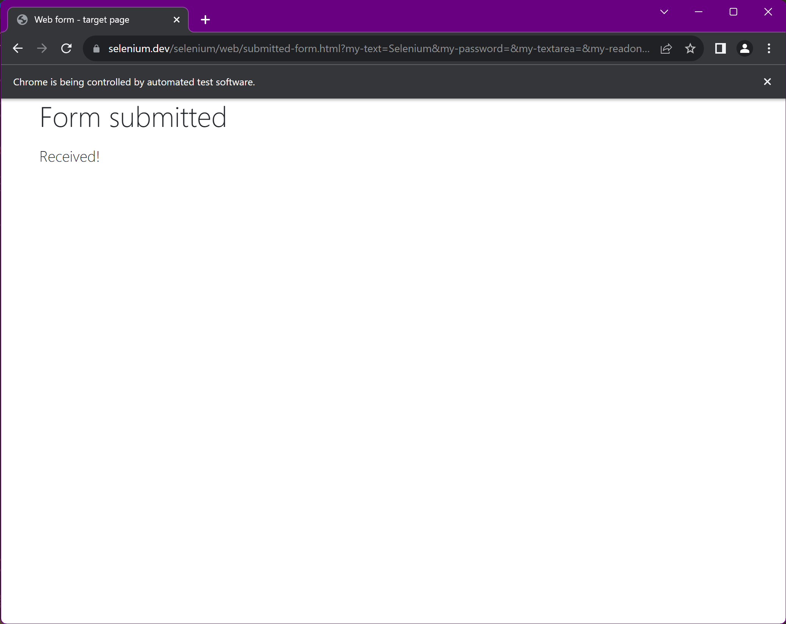
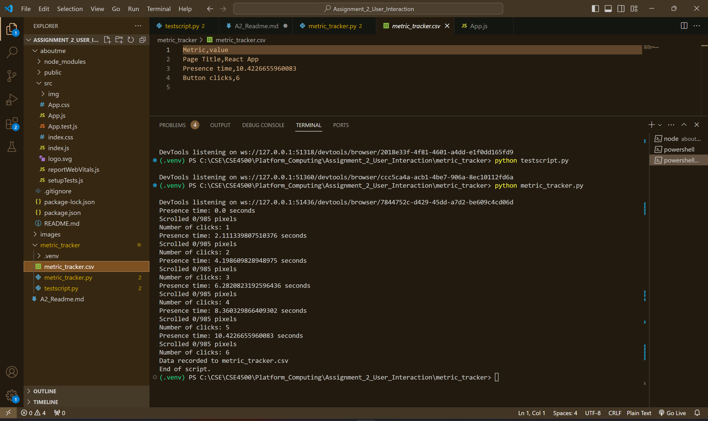
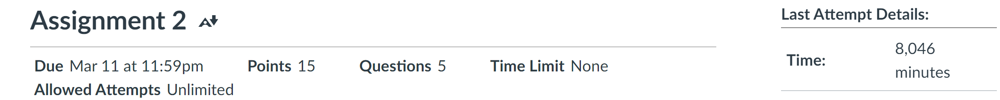

# Metric Tracker

PROVIDE OVERVIEW OF ASSIGNMENT HERE

Time spent: **4** hours spent in total

## Features

The following **required** features are completed:

- [x] Organize Github project for Assignment 2 (2 pt)
- [x] Transfer your About Me Page into a React App with screenshot of output in the Images folder(3 pt)
- [x] Set up Selenium (2 pt)
- [x] Write your first Selenium script with screenshot of output in the Images folder (4 pt)
- [x] Monitor at least 2 metrics using Selenium with screenshot of output in the Images folder (4 pt)

The following **bonus** features are implemented:

- [x] Saves metrics into csv file (1 pt)
- [x] Monitors at least 4 metrics (1 pt)
- [ ] DESCRIBE ANY OTHER FEATURES HERE.

## Screenshot and/or Video Walkthrough
About Me in React

Selenium tutorial script output

Metric tracker output + csv file

## Notes:
PROVIDE RELEVANT OR ADDITIONAL INFORMATION HERE. Below are formatting options to add emphasis in text
<ul>
  <li>metric_tracker uses the code given in class as a basis</li>
</ul>

