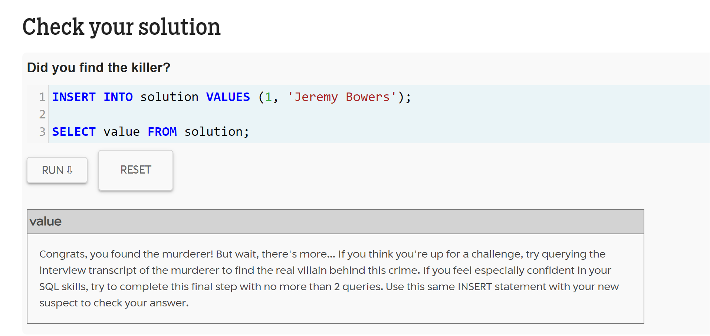
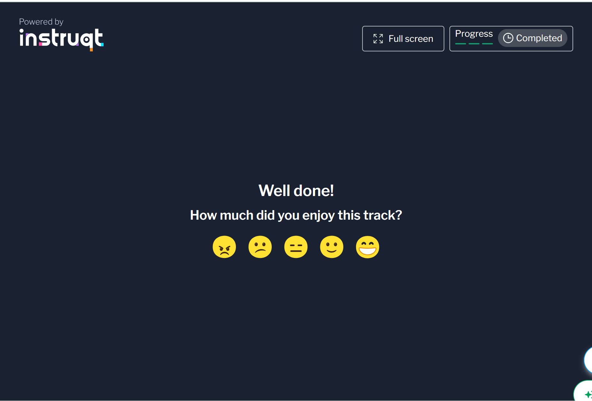
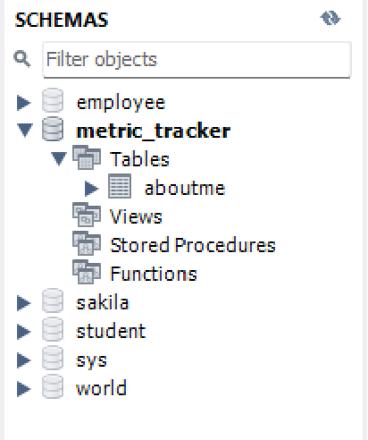
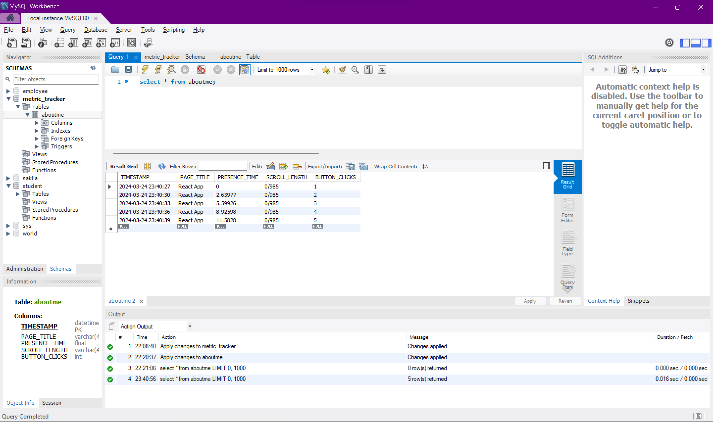

# Metric Tracker with Database

Integration of database(mySQL) with the metric tracker

Time spent: **5** hours spent in total

## Features

The following **required** features are completed:

- [x] Organize Github projects for Assignment 3 (2 pts)
- [x] Complete SQL Mystery Walkthrough and take a screenshot or print to PDF the webpage (2 pts)
- [x] Complete Interactive MongoDB Tutorial and take a screenshot or print to PDF the webpage  (2 pts)
- [x] Choose a <u>SQL</u> or NoSQL Database and set up a server (4 pts)
- [x] Modify your metric_tracker file so that the metrics are saved onto a database (5 pts)

The following **bonus** features are implemented:

- [ ] Retrieve values from the database (1 pt).
- [ ] Create separate Tables (SQL) or Documents (NoSQL) for each metric and relate them via user (2 pt).
- [ ] DESCRIBE ANY OTHER FEATURES HERE.

## Screenshot and/or Video Walkthrough

SQL Tutorial

MongoDB

Database Setup

Database w/ Data

## Notes:
PROVIDE RELEVANT OR ADDITIONAL INFORMATION HERE. Below are formatting options to add emphasis in text
<ul>
  <li>Spent a embarassing amount of time trying to install mysql-python connector</li>
</ul>
